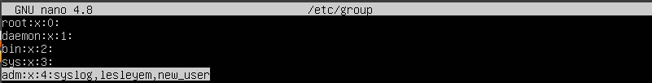
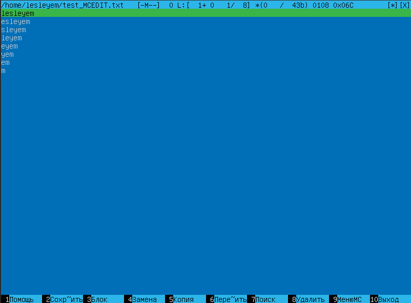
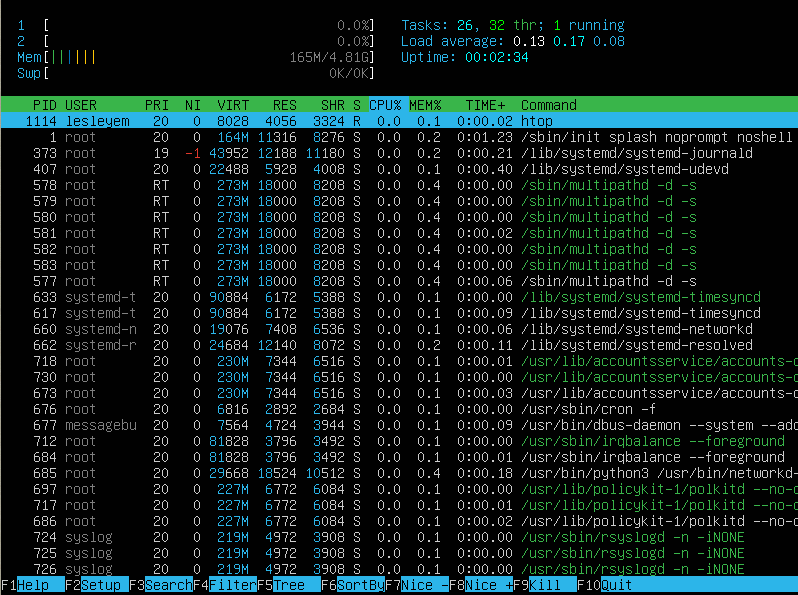
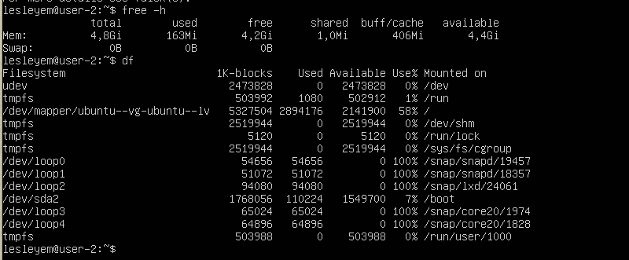
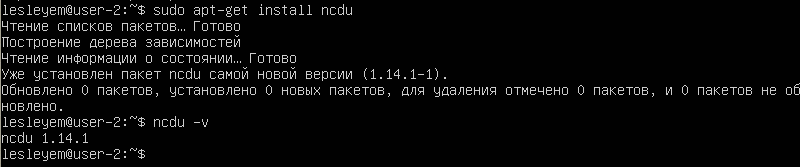

# Операционные системы UNIX/Linux (Базовый).
Установка и обновления системы Linux. Основы администрирования.

## Содержание
1. [Установка ОС](#part-1-установка-ос)  
2. [Создание пользователя](#part-2-создание-пользователя)  
3. [Настройка сети ОС](#part-3-настройка-сети-ос)   
4. [Обновление ОС](#part-4-обновление-ос)  
5. [Использование команды  sudo](#part-5-использование-команды-sudo)  
6. [Установка и настройка службы времени](#part-6-установка-и-настройка-службы-времени)  
7. [Установка и использование текстовых редакторов](#part-7-установка-и-использование-текстовых-редакторов)  
8. [Установка и базовая настройка сервиса SSHD](#part-8-установка-и-базовая-настройка-сервиса-sshd)   
9. [Установка и использование утилит top, htop](#part-9-установка-и-использование-утилит-top-htop)   
10. [Использование утилиты fdisk](#part-10-использование-утилиты-fdisk)   
11. [Использование утилиты df](#part-11-использование-утилиты-df)    
12. [Использование утилиты du](#part-12-использование-утилиты-du)    
13. [Установка и использование утилиты ncdu](#part-13-установка-и-использование-утилиты-ncdu)    
14. [Работа с системными журналами](#part-14-работа-с-системными-журналами)     
15. [Использование планировщика заданий CRON](#part-15-использование-планировщика-заданий-cron)   

## Part 1. Установка ОС

- Установка Ubuntu 20.04 Server LTS без графического интерфейса:

## Part 2. Создание пользователя

- Создание пользователя и добавление его в группу adm:

- Проверка вывода команды \ `cat /etc/passwd`:

- Проверка добавления пользователя в группу adm:

## Part 3. Настройка сети ОС

- Задание названия машины вида user-1 и его проверка:

- Установка временной зоны:

- Вывод названий сетевых интерфейсов:

lo (loopback device) – виртуальный интерфейс, присутствующий по умолчанию в любом Linux. Он используется для отладки сетевых программ и запуска серверных приложений на локальной машине. С этим интерфейсом всегда связан адрес 127.0.0.1 (dns-имя – localhost). 

- Получение ip адреса устройства:

DHCP (Dynamic Host Configuration Protocol) — протокол прикладного уровня модели TCP/IP, служит для назначения IP-адреса клиенту.

- Вывод на экран внешний ip-адрес шлюза (ip) и внутренний IP-адрес шлюза:

- Установка статичных настроек ip, gw, dns:

- Проверка статичных сетевых настроек (ip, gw, dns) после перезагрузки виртуальной машины:

- Пингование удаленных хостов 1.1.1.1 и ya.ru:

## Part 4. Обновление ОС

- Обновление системных пакетов:  

## Part 5. Использование команды **sudo**

- Выдача разрешения пользователю, созданному в [Part 2](#part-2-создание-пользователя), выполнять команду sudo и изменение hostname ОС от его имени:

*sudo* (англ. Substitute User and do, дословно «подменить пользователя и выполнить») — утилита, позволяющая выполнить команду от имени другого пользователя, обычно от root. Смысл выполнения команды от root в том, что у него повышенные права доступа и, применяя sudo, обычный пользователь может выполнить те действия, на которые у него недостаточно прав.

## Part 6. Установка и настройка службы времени

- Вывод времени и часового пояса:

## Part 7. Установка и использование текстовых редакторов 

- установка VIM, NANO, MCEDIT:

- создание тестовых файлов:

- работа в VIM с сохранением:

1. Переход в режим вставки нажатием на клавишу I;
2. Ввод никнейма;
3. Нажатие на Esc;
4. Ввод wq.

- работа в NANO с сохранением:

1. Ввод никнейма;
2. Нажатие Ctrl + X;
3. Ввод Y.

- работа в MCEDIT с сохранением:

1. Ввод никнейма;
2. Нажатие F2;
3. Нажатие F10.

- работа в VIM без сохранения:

1. Переход в режим вставки нажатием на клавишу I;
2. Ввод 21 School 21;
3. Нажатие на Esc;
4. Ввод q!.

- работа в NANO без сохранения:

1. Ввод 21 School 21;
2. Нажатие Ctrl + X;
3. Ввод N.

- работа в MCEDIT без сохранения:

1. Ввод 21 School 21;
2. Нажатие F10;
3. Нажатие Нет.

- работа в VIM по поиску и замене:

Поиск через команду /текст

Замена через команду :%s/старый_текст/новый_текст

- работа в NANO по поиску и замене:

Поиск через Ctr+W и ввод текста

Замена через команду Ctr+\ и ввод текста

- работа в MCEDIT с сохранением:

Поиск через F7

Замена через F4
## Part 8. Установка и базовая настройка сервиса **SSHD**

- Установка службы SSHd:

- Добавление автостарт службы при загрузке системы:

- Перенастройка службы SSHd на порт 2022:

- Отображение наличия процесса sshd, используя команду ps:

Команда ps выводит статистику и информацию о состоянии процессов в системе, в том числе ИД процесса или нити, объем выполняемого ввода-вывода и используемый объем ресурсов процессора и памяти.

-a  вывод на дисплей процессы всех пользователей, за исключением тех процессов, которые не связаны с терминалом и процессами группы лидеров.

-u  подставки для ориентированных на пользователя формате, который обеспечивает подробную информацию о процессах.

-x  перечисление процессов без управляющего терминала. В основном это процессы, которые запускаются во время загрузки и работают в фоновом режиме.

- Перезагрузка системы:

- Вывод команды netstat -tan:

Ключи:

-a	показывать состояние всех сокетов;

-n	показывать ip адрес, а не сетевое имя;

-t  показывать список активных портов TCP.

Столбцы:

-Proto   протокол, используемый сокетом;

-Recv-Q  количество байтов, не скопированных пользовательской программой, подключенной к этому сокету;

-Send-Q  количество неподтвержденных байтов удаленного хоста;

-Local Address  локальный адрес (имя локального хоста) и номер порта сокета;

-Foreign Address  удаленный адрес (имя удаленного хоста) и номер порта сокета;

-State  состояние сокета;

-0.0.0.0  подключение может быть выполнено с/на любой адрес LISTEN готовность к установке соединения.

## Part 9. Установка и использование утилит **top**, **htop**

- Установка и запуск top:

-uptime: 6 min;

-количество авторизованных пользователей: 1 user;

-общая загрузка системы: 0,00, 0,07, 0,05;

-общее количество процессов: 103 total, 1 running, 102 sleeping, 0 stopped, 0 zombie;

-загрузка cpu: 0,0 us, 0,0 sy, 0,0 ni, 100,0 id, 0,0 wa, 0,0 hi, 0,0 si, 0,0 st;

-загрузка памяти: 4921,8 total, 4360,1 free, 163,3 used, 398,3 buff/cache;

-pid процесса занимающего больше всего памяти 1117;

-pid процесса, занимающего больше всего процессорного времени 1.

- Установка и запуск htop:

-Сортировка по PID:

-Сортировка по PERCENT_CPU:

-Сортировка по PERCENT_MEM:

-Сортировка по TIME:

-Фильтрация для процесса sshd:

-с процессом syslog, найденным, используя поиск:

-с добавленным выводом hostname, clock и uptime:

## Part 10. Использование утилиты **fdisk**

- Запуск команды fdisk -l.

-Название /dev/sda;

-Размер 7 GiB;

-Количество секторов  14680064;

-Размер swap 0.

## Part 11. Использование утилиты **df** 

- Запуск команды df:

-размер корневого раздела (/):  5327504;
-размер занятого пространства корневого раздела (/):  2894176;
-размер свободного пространства корневого раздела (/):  2141900;
-процент использования корневого раздела (/): 58%;
-Единица измерения в выводе:  1K-blocks.

- Запуск команды df -Th.

- размер корневого раздела (/): 5,1G;
- размер занятого пространства корневого раздела (/): 2,8G;
- размер свободного пространства корневого раздела (/): 2,1G;
- процент использования корневого раздела (/):  58%;
- Тип файловой системы для раздела: ext4.

## Part 12. Использование утилиты **du**

- Запуск команды du:

- Вывод размера папок /home, /var, /var/log:

- Вывод размера всего содержимого в /var/log:

## Part 13. Установка и использование утилиты **ncdu**

- Установка утилиты ncdu:

- Вывод размера папки /home:

- Вывод размера папки /var:

- Вывод размера папки /var/log:

## Part 14. Работа с системными журналами

- Открытие для просмотра:

-/var/log/dmesg:

-/var/log/syslog:

-/var/log/auth.log:

- Время последней успешной авторизации, имя пользователя и метод входа в систему:

-время авторизации Aug 8 00:33

-имя пользователя lesleyem

-метод входа в систему tty1

- Перезапуск службы SSHd с помощью sudo systemctl restart ssh и сообщение о рестарте службы в логах:

## Part 15. Использование планировщика заданий **CRON**

- Запуск команды uptime через каждые 2 минуты, используя планировщик заданий:

- Вывод на экран списка текущих заданий для CRON:

- Вывод на экран списка системных задач:

- Удаление всех заданий из планировщика заданий.

