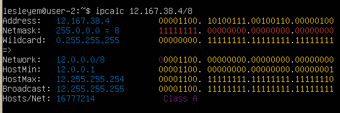
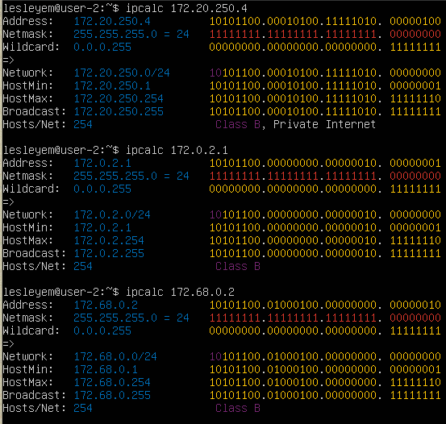
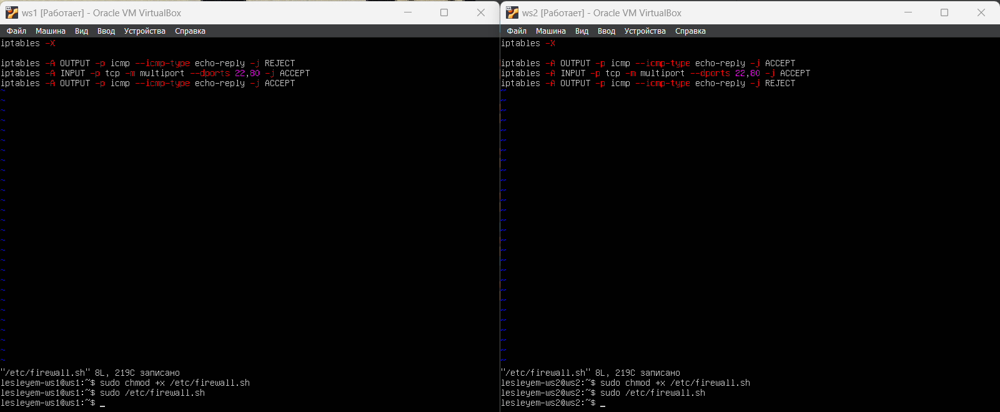
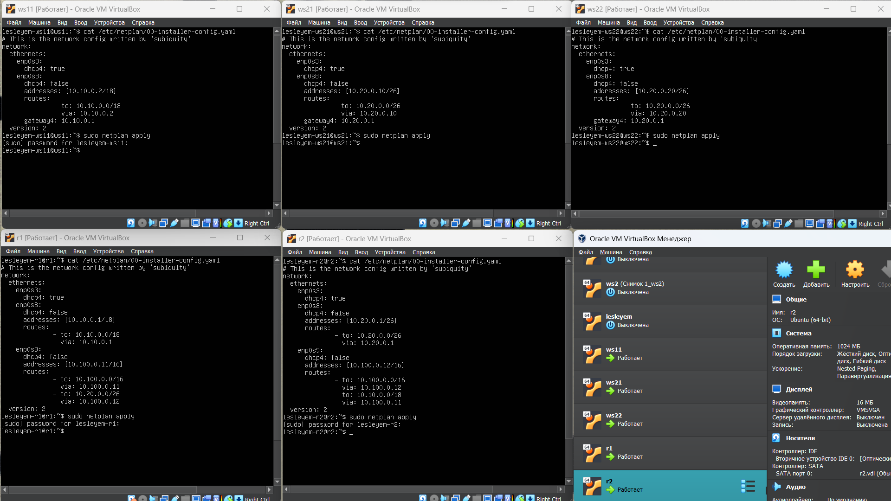
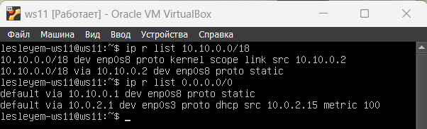

# Сети в Linux

Настройка сетей в Linux на виртуальных машинах.

## Contents

   1. [Инструмент ipcalc](#part-1-инструмент-ipcalc)
   2. [Статическая маршрутизация между двумя машинами](#part-2-статическая-маршрутизация-между-двумя-машинами)
   3. [Утилита iperf3](#part-3-утилита-iperf3)
   4. [Сетевой экран](#part-4-сетевой-экран)
   5. [Статическая маршрутизация сети](#part-5-статическая-маршрутизация-сети)
   6. [Динамическая настройка IP с помощью DHCP](#part-6-динамическая-настройка-ip-с-помощью-dhcp)
   7. [NAT](#part-7-nat)
   8. [Допополнительно. Знакомство с SSH Tunnels](#part-8-дополнительно-знакомство-с-ssh-tunnels)

## Part 1. Инструмент **ipcalc**
- Установка ipcalc:

##### Поднять виртуальную машину (далее -- ws1)

- 1.1. Сети и маски:

    1) определение адреса сети *192.167.38.54/13*:

адрес сети 192.167.38.54/13 = 192.167.38.54;

2) перевод маски *255.255.255.0* в префиксную и двоичную запись, */15* в обычную и двоичную, *11111111.11111111.11111111.11110000* в обычную и префиксную:

перевод маски 255.255.255.0 в префиксную запись = /24, в двоичную запись = 11111111.11111111.11111111.000000000,

перевод /15 в обычную запись = 255.254.0.0, в двоичную запись = 11111111.11111110.00000000. 000000000,

перевод 11111111.11111111.11111111.11110000 в обычную запись = 255.255.255.240, в префиксную запись = /28;

3) минимальный и максимальный хост в сети *12.167.38.4* при масках: */8*, *11111111.11111111.00000000.00000000*, *255.255.254.0* и */4*:

минимальный хост = 12.0.0.1,

максимальный хост = 12.255.255.254,

минимальный хост = 12.167.0.1,

максимальный хост = 12.167.255.254,
        

минимальный хост = 12.167.38.1,

максимальный хост = 12.167.39.254,

минимальный хост = 0.0.0.1,

максимальный хост = 15.255.255.254.

- 1.2. localhost:

определение возможности обратиться к приложению, работающему на localhost, со следующими IP: *194.34.23.100*, *127.0.0.2*, *127.1.0.1*, *128.0.0.1*:

-нельзя,

-можно,

-можно,

-можно.

- 1.3. Диапазоны и сегменты сетей:

1) определение публичных и частных IP: *10.0.0.45*, *134.43.0.2*, *192.168.4.2*, *172.20.250.4*, *172.0.2.1*, *192.172.0.1*, *172.68.0.2*, *172.16.255.255*, *10.10.10.10*, *192.169.168.1*:

таким образом, получим:

-публичные: 134.43.0.2, 172.0.2.1, 172.68.0.2, 192.172.0.1, 192.169.168.1,

-частные: 10.0.0.45, 192.168.4.2, 172.20.250.4, 172.16.255.255, 10.10.10.10;

2) определение IP адресов шлюза, возможных у сети *10.10.0.0/18*: *10.0.0.1*, *10.10.0.2*, *10.10.10.10*, *10.10.100.1*, *10.10.1.255*:

у сети возможны: 10.10.0.2, 10.10.10.10, 10.10.1.255.

## Part 2. Статическая маршрутизация между двумя машинами

С помощью команды `ip a` посмотреть существующие сетевые интерфейсы:

Описать сетевой интерфейс, соответствующий внутренней сети, на обеих машинах и задать следующие адреса и маски: ws1 - *192.168.100.10*, маска */16*, ws2 - *172.24.116.8*, маска */12*. Выполнить команду `netplan apply` для перезапуска сервиса сети:

- 2.1. Добавление статического маршрута вручную:

Добавить статический маршрут от одной машины до другой и обратно при помощи команды вида `ip r add`, пропинговать соединение между машинами:

- 2.2. Добавление статического маршрута с сохранением:

Добавить статический маршрут от одной машины до другой с помощью файла *etc/netplan/00-installer-config.yaml*, пропинговать соединение между машинами:

## Part 3. Утилита **iperf3**

- 3.1. Скорость соединения. 

Перевести и записать в отчёт: 8 Mbps в MB/s, 100 MB/s в Kbps, 1 Gbps в Mbps:

8 Mbps /8 = 1 MB/s

100 MB/s * 1000 * 8 = 800000 Kbps

1 Gbps * 1000 = 1000 Mbps

- 3.2. Утилита **iperf3**. Измерить скорость соединения между ws1 и ws2:

5.41 Gbits/s

## Part 4. Сетевой экран

- 4.1. Утилита **iptables**. 

Создать файл */etc/firewall.sh*, имитирующий фаерволл, на ws1 и ws2:

Запустить файлы на обеих машинах командами `chmod +x /etc/firewall.sh` и `/etc/firewall.sh`

Разница между стратегиями заключается в том, что при составлении цепочек правил в iptables важна очередность этих правил. Так, фалг -А добавлает правило в конец цепочки. Правила,находящиеся выше по цепочке более приоритетны и исполняются в первую очередь. Поэтому для ws1 все входящие пакеты (в том числе ping) отклоняются, а на ws2 принимаются.

- 4.2. Утилита **nmap**. 

Командой **ping** найти машину, которая не "пингуется", после чего утилитой **nmap** показать, что хост машины запущен:

В выводе nmap сказано: `Host is up`

## Part 5. Статическая маршрутизация сети

Поднять пять виртуальных машин (3 рабочие станции (ws11, ws21, ws22) и 2 роутера (r1, r2)):

- 5.1. Настройка адресов машин

Настроить конфигурации машин в *etc/netplan/00-installer-config.yaml*.

Командой `ip -4 a` проверить, что адрес машины задан верно. Также пропинговать ws22 с ws21. Аналогично пропинговать r1 с ws11.

- 5.2. Включение переадресации IP-адресов.

Выполнение команды на роутерах для включения переадресации IP:

Изменение файла */etc/sysctl.conf*:

- 5.3. Установка маршрута по-умолчанию

Настроить маршрут по-умолчанию (шлюз) для рабочих станций. Для этого добавить `default` перед IP роутера в файле конфигураций. Вызвать `ip r` и показать, что добавился маршрут в таблицу маршрутизации

Пропинговать с ws11 роутер r2 и показать на r2, что пинг доходит. Для этого использовать команду:

- 5.4. Добавление статических маршрутов

Добавить в роутеры r1 и r2 статические маршруты в файле конфигураций.

Вызвать `ip r` и показать таблицы с маршрутами на обоих роутерах.

Запустить команды `ip r list 10.10.0.0/[маска сети]` и `ip r list 0.0.0.0/0` на ws11:

Для адреса 10.10.0.0/18 был выбран маршрут, отличный от 0.0.0.0/0, так как маршрут по умолчанию имеет меньшую приоритетность. Адрес 10.10.0.0/18 - также адрес сети, поэтому он доступен без шлюза.

- 5.5. Построение списка маршрутизаторов

Запустить на r1 команду дампа `tcpdump -tnv -i eth0`:

При помощи утилиты **traceroute** построить список маршрутизаторов на пути от ws11 до ws21

Принцип построения пути при помощи traceroute: Для определения промежуточных маршрутизаторов traceroute отправляет целевому узлу серию ICMP-пакетов (по умолчанию 3 пакета), с каждым шагом увеличивая значение поля TTL («время жизни») на 1. Это поле обычно указывает максимальное количество маршрутизаторов, которое может быть пройдено пакетом. Первая серия пакетов отправляется с TTL, равным 1, и поэтому первый же маршрутизатор возвращает обратно ICMP-сообщение «time exceeded in transit», указывающее на невозможность доставки данных. Traceroute фиксирует адрес маршрутизатора, а также время между отправкой пакета и получением ответа (эти сведения выводятся на монитор компьютера). Затем traceroute повторяет отправку серии пакетов, но уже с TTL, равным 2, что заставляет первый маршрутизатор уменьшить TTL пакетов на единицу и направить их ко второму маршрутизатору. Второй маршрутизатор, получив пакеты с TTL=1, так же возвращает «time exceeded in transit». Процесс повторяется до тех пор, пока пакет не достигнет целевого узла. При получении ответа от этого узла процесс трассировки считается завершённым.

- 5.6. Использование протокола **ICMP** при маршрутизации

Запустить на r1 перехват сетевого трафика, проходящего через eth0 с помощью команды `tcpdump -n -i eth0 icmp`.  Пропинговать с ws11 несуществующий IP (например, *10.30.0.111*) с помощью команды `ping -c 1 10.30.0.111`:

## Part 6. Динамическая настройка IP с помощью **DHCP**

Для r2 настроить в файле */etc/dhcp/dhcpd.conf* конфигурацию службы **DHCP**:. 

1) указать адрес маршрутизатора по-умолчанию, DNS-сервер и адрес внутренней сети.

2) в файле *resolv.conf* прописать `nameserver 8.8.8.8.`

Перезагрузить службу **DHCP** командой `systemctl restart isc-dhcp-server`. Машину ws21 перезагрузить при помощи `reboot` и через `ip a` показать, что она получила адрес. Также пропинговать ws22 с ws21.

Указать MAC адрес у ws11, для этого в *etc/netplan/00-installer-config.yaml* надо добавить строки: `macaddress: 10:10:10:10:10:BA`, `dhcp4: true`

Для r1 настроить аналогично r2, но сделать выдачу адресов с жесткой привязкой к MAC-адресу (ws11). Провести аналогичные тесты

Запросить с ws21 обновление ip адреса

1)Принудительного освобождаем IP-адрес DHCP-клиента с помощью команды `sudo dhclient -r`

2)Получаем новый IP-адрес с помощью DHCP с помощью команды `sudo dhclient`

3)Через `ip a` показываем что адрес ws21 сменился

Используемые опции:

Настройка конфигурации службы DHCP (адрес маршрутизатора по-умолчанию, DNS-сервер, адрес внутренней сети, привязка к MAC-адресу)

Клиент протокола динамической конфигурации хоста (команда dhclient) для обновления или освобождения IP-адреса

## Part 7. **NAT**

В файле */etc/apache2/ports.conf* на ws22 и r1 изменить строку `Listen 80` на `Listen 0.0.0.0:80`, то есть сделать сервер Apache2 общедоступным

Запустить веб-сервер Apache командой `service apache2 start` на ws22 и r1

Добавить в фаервол на r2 правила. Запустить и проверить соединение между ws22 и r1 командой `ping`

Добавить в файл ещё одно правило. Запустить файл и проверить соединение между ws22 и r1 командой `ping`

Добавить в файл ещё два правила. Запустить файл. Проверить соединение по TCP для **SNAT**, для этого с ws22 подключиться к серверу Apache на r1 командой `telnet [адрес] [порт]`. Проверить соединение по TCP для **DNAT**, для этого с r1 подключиться к серверу Apache на ws22 командой `telnet` (обращаться по адресу r2 и порту 8080)

## Part 8. Дополнительно. Знакомство с **SSH Tunnels**

Запустить на r2 фаервол с правилами из Части 7. Запустить веб-сервер **Apache** на ws22 только на localhost (то есть в файле */etc/apache2/ports.conf* изменить строку `Listen 80` на `Listen localhost:80`)

Воспользоваться *Local TCP forwarding* с ws21 до ws22, чтобы получить доступ к веб-серверу на ws22 с ws21

`ssh -L 8080:localhost:80 lesleyem@10.20.0.20`

Воспользоваться *Remote TCP forwarding* c ws11 до ws22, чтобы получить доступ к веб-серверу на ws22 с ws11

`ssh -R 8080:localhost:80 lesleyem@10.20.0.20`

Для проверки, сработало ли подключение в обоих предыдущих пунктах, выполняется команда в другом терминале `telnet 127.0.0.1 [локальный порт]`
